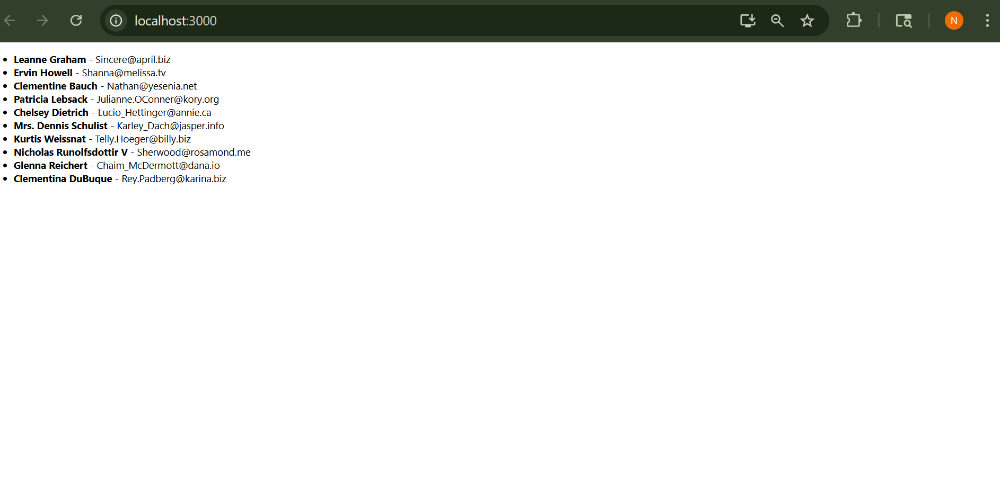

#Basic API + map() Function in React

This is a beginner-friendly React project that fetches user data from a public API and displays it using the JavaScript `map()` function.


##  Topics Covered
- What is an API
- HTTP GET request using `fetch()`
- Using `useEffect` and `useState`
- Basic error handling
- Rendering list using `.map()`

##  Tech Stack
- React
- JavaScript (ES6)
- JSONPlaceholder API
- 
##Screenshot

##  How to Run Locally

1. Clone the repository:
```bash
git clone https://github.com/tnikhilchowdary/BasicApi-MapFunction.git
